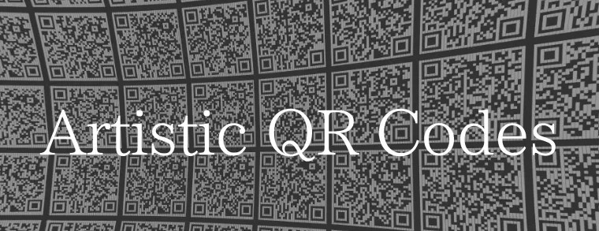
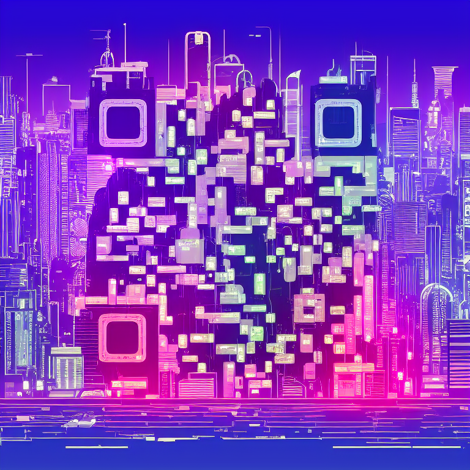
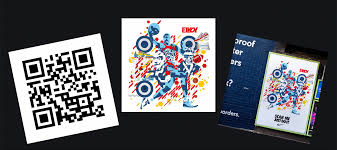
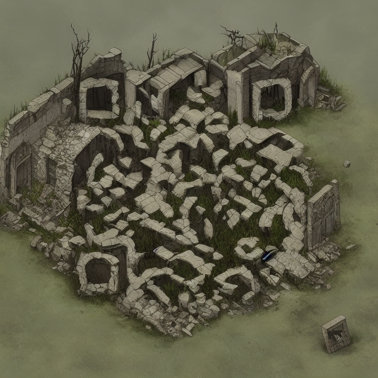

# Styled and Artistic QR-codes
<br>
This is a project where we are going to make styled and artistic qr codes with the help of machine learning models <br>
<br> <p  align = "center" >   </p>
<br>

## Introduction 
<br> See these amazing qr codes the are generated with the help of machine learning models <br> <p>
  


 </p>
<br>
Since they first came into being decades ago, QR codes have been a great way to share material, including URLs. Although they might be helpful, their appearance is set in stone, resulting in a plethora of bland, colorless QR codes.<br>
That is going to change, though.<br>
Modern image creation methods, such as ControlNets and Stable Diffusion or nural style transfer models, allow us to build amazing-looking QR codes.


<br>
<p  align = "center" >
 </p>

## Documentation  

### For creation here we have used 3 different models
1. #### Nural style transfer 
with the help of nural style tranfer here we could alter the qr codes from the base image itself 

<br>
<table>
  
<tr>
   <td align="center">Style </td>
   <td align="center">Output</td> 
</tr>
 
<tr>
 <td height="250" width="280" align="center"><div align=center></td>
 <td rowspan="2" align="center" width="550" height="550"></td>
</tr>
<tr height="250">
  <td align="center" width="280"><div align=center><div align=center></td> 
</tr>

</table>

From the above we can see how the qr image have take in the style of the base image and resulted in in a new styled one 
<br><br>
To know futher in detail  and use the model for qr code creation <a href="https://github.com/deveshruttala/styled-qrcodes.git">follow</a>

```
git clone --branch https://github.com/deveshruttala/styled-qrcodes.git
```

2. #### Nural style transfer with prompt and code images 
<br>

<table>
  
<tr>
   <td align="center">Style </td>
   <td align="center">Output</td> 
</tr>
 
<tr>
 <td height="250" width="280" align="center"><div align=center></td>
 <td rowspan="2" align="center" width="550" height="550"></td>
</tr>
<tr height="250">
  <td align="center" width="280"><div align=center><div align=center></td> 
</tr>
</table>
<br>
With the help of enchanced prompt and code image correction techniques we are result the output 

<br><br>

To know futher in detail and use the model for qr code creation <a href="https://github.com/deveshruttala/styled-qrcodes.git">follow</a>

```
git clone --branch https://github.com/deveshruttala/styled-qrcodes.git
```


3. #### QR codes with Stable diffusion and controlnet 

<br>
<table>
  
<tr>
   <td align="center">Style </td>
   <td align="center">Output</td> 
</tr>
 
<tr>
 <td height="250" width="280" align="center"><div align=center></td>
 <td rowspan="2" align="center" width="550" height="550"></td>
</tr>
<tr height="250">
  <td align="center" width="280"><div align=center><div align=center></td> 
</tr>

</table>

<br><br>

To know futher in detail and use the model for qr code creation <a href="https://github.com/deveshruttala/styled-qrcodes.git">follow</a>

```
git clone --branch https://github.com/deveshruttala/styled-qrcodes.git
```


<br>

## Conclusion and credits

<br>
We can now take a plain image, like a QR code, and use generative AI to make it into something lovely and personalized. Although this technology is still in its infancy, improvements are constantly being made to the models' quality.<br>


To get effective outcomes with generative AI applications, as with most other applications, experimenting is essential. Therefore, I strongly advise you to experiment with the code and other settings to learn more about the system's operation and make some really awesome QR codes along the way.
<br>
<br>

I thank you reading! keep making some amazing QR codes 
<br> <p>
   
</p>

* Credits: artcoder, DionTimmer
* View the repo branches to know in detail of this project and how to make artistic qr codes 
<br>
<br>
Owner : <a href="https://github.com/deveshruttala">  #### Devesh  </a> 

