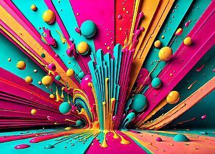
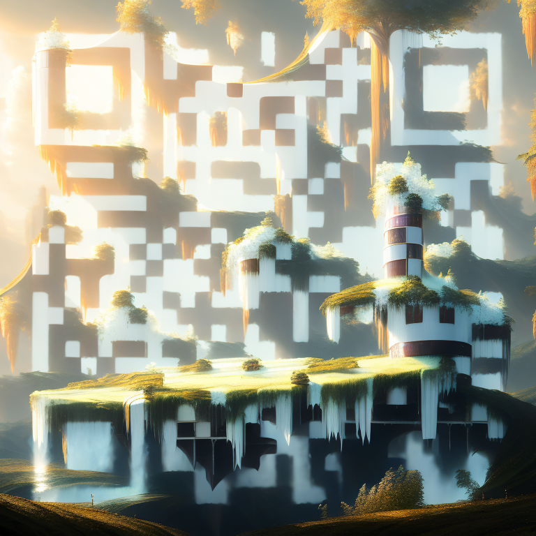
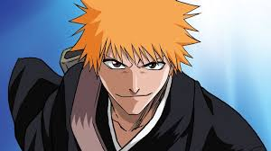

# Description <br>

In this branch we use the stable diffusion and control net model to execute out artistic or styled qr codes 
<br>


* About the model
Stable Diffusion is a popular and open source text-to-image generator. A neural network called ControlNet is used to regulate a pretrained image diffusion model, such as Stable Diffusion. Its purpose is to enable the insertion of a conditioning picture so that the image production can be altered.<br>
In essence, it lets us manipulate the output image by manipulating another image. The text to image generation in this instance is based on the QR Code, which serves as the control image. This makes it possible to create some really imaginative QR Codes.

<br>
Along with providing the source code to begin interacting with the model,Dion Timmer has kindly created a model <a href="https://huggingface.co/DionTimmer/controlnet_qrcode-control_v11p_sd21">repository</a> on HuggingFace. You can utilize an additional image in addition to a text prompt in the Dion Timmer model to direct the creation of your final QR code. One of the best things about that is that it allows you to include a logo or brand sign into your QR image by combining the QR code and the image you upload.
<br>
The StableDiffusionControlNetImg2ImgPipeline, ControlNetModel, DDIMScheduler are all part of the HuggingFace diffusors library. As per the HuggingFace docs:
Diffusers is the go-to library for state-of-the-art pretrained diffusion models for generating images, audio, and even 3D structures of molecules. Whether you’re looking for a simple inference solution or want to train your own diffusion model, 🤗 Diffusers is a modular toolbox that supports both
<br>
So the diffusors library is our go to place for working with ML models, and using them to generate things like images and text.
Here, we are creating a ControlNetModel using the “DionTimmer/controlnet_qrcode-control_v11p_sd21” model from HuggingFace as our source. This will literally cause the script to go to that model repository from HuggingFace, and pull all the model files from there, in order to generate our images
<br>
Then we create our pipeline using our control net model. Pipelines are like the higher level wrapper classes we can use to run our inferencing on. As per the HuggingFace docs,
A pipeline is an end-to-end class that provides a quick and easy way to use a diffusion system for inference by bundling independently trained models and schedulers together.
<br><br>


Finally from my learnings from this model training includes the models is in its initial stage and mostly  relys prompt and argument inputs than the given input image, the input image mostly works as a reference only to taking in some style for building the qr. 
<br>After most observations I have seen that google lens mostly fails to identify the qr and mostly the other qr coder app like (https://play.google.com/store/apps/details?id=com.gamma.scan ) this can easily detect the qr codes  


<br>
<table>
  
<tr>
   <td align="center">Style </td>
   <td align="center">Output</td> 
</tr>
 
<tr>
 <td height="250" width="280" align="center"><div align=center></td>
 <td rowspan="2" align="center" width="550" height="550"></td>
</tr>
<tr height="250">
  <td align="center" width="280"><div align=center><div align=center></td> 
</tr>

<tr>
 <td height="250" width="280" align="center"><div align=center></td>
 <td rowspan="2" align="center" width="550" height="550"></td>
</tr>
<tr height="250">
  <td align="center" width="280"><div align=center><div align=center></td> 
</tr>
    
 <tr>
 <td height="250" width="280" align="center"><div align=center></td>
 <td rowspan="2" align="center" width="550" height="550"></td>
</tr>
<tr height="250">
  <td align="center" width="280"><div align=center><div align=center></td> 
</tr>

</table>
<br>

## Prerequisites
 * Google colab
 * Linux or Windows
 * CPU or NVIDIA GPU + CUDA CuDNN
 * Python 
 * Pytorch 

# Getting Started


<br> To start off you can start either downloading the file and running it locally on the system or else upload the qrcodewithcontrolnet_ai.ipynb 
<br>
* install the requriments in to the system 

``` 
!pip -q install diffusers transformers accelerate torch xformers 
```
<br>
* Run the program and upload the requried images in the content (google colab) and set your arguments 

Example here shows arguments set for making a qr code <br>
Arguments include:<br> 
1. guidance_scale: The higher the values, the sharper the final image is, including the QR Code and base image. Below is an idea of what it looks like when varying the value between 0 and 100, where the middle one is at the near optimum value of 20
2. controlnet_conditioning_scale: This tweaks how strong to make the QR image vs the base image. The images below you can see the results when varying the value between 0–5. At low values, the QR code does not come through at all. At high values, all you can see is the QR code. This field seems to have the ability to remove the base image nearly completely. With the other fields, the base image always comes through at least a little, even at higher values.
3. strength: this also controls how strong the QR code comes through over the base image. At low values the QR code barely comes though. At high values it is much more dominant.
4. last one includes the prompts like  " bleach ,anime, modern, 8K, action"
 <br>

```

image = pipe(
    prompt=" bleach ,anime, modern, 8K, action",
    negative_prompt="ugly, disfigured, low quality, blurry, nsfw",
    image=base_image,
    control_image=qr_code_image,
    width=768,
    height=768,
    guidance_scale=20,  # The higher the values, the sharper the final image is, including the QR Code and base image. Below is an idea of what it looks like when varying the value between 0 and 100, where the middle one is at the near optimum value of 20
    controlnet_conditioning_scale=1.5,  # This tweaks how strong to make the QR image vs the base image. The images below you can see the results when varying the value between 0–5. At low values, the QR code does not come through at all. At high values, all you can see is the QR code. This field seems to have the ability to remove the base image nearly completely.
    generator=generator,
    strength=1.5,  # this also controls how strong the QR code comes through over the base image. At low values the QR code barely comes though. At high values it is much more dominant.
    num_inference_steps=150
)

```

<br>


## Credits and References 
Complete information on controlnet visit:  https://github.com/lllyasviel/ControlNet/tree/main
Huggingface qrcode model: https://huggingface.co/DionTimmer/controlnet_qrcode-control_v11p_sd21