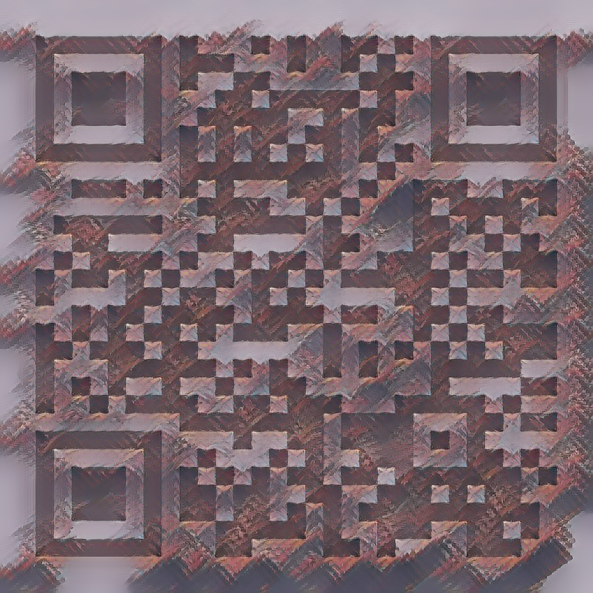

# Description 
In this branch you can view what will happen if you are using normal nural style tranfer model for execution of transfering details in to the requried qr code 

we are using the model : https://tfhub.dev/google/magenta/arbitrary-image-stylization-v1-256/2 for execution of basic nural style transfer 

we can view the following output from the results: 

<table>
  
<tr>
   <td align="center">Style&Content</td>
   <td align="center">Output</td> 
</tr>
 
<tr>
 <td height="250" width="280" align="center">
</td>
 <td rowspan="2" align="center" width="550" height="550"></td>
</tr>
<tr height="250">
  <td align="center" width="280">

</td> 
</tr>

<tr>
 <td height="250" width="280" align="center">
</td>
 <td rowspan="2" align="center" width="550" height="550"></td>
</tr>
<tr height="250">
  <td align="center" width="280">

</td> 
</tr>

</table>

## Prerequisites
 
 * Linux or Windows
 * CPU or NVIDIA GPU + CUDA CuDNN
 * Python 3
 * tensorflow

## Getting Started

to use this just import the nural_style_transfer_qrcodes.ipynb file into colab notebook and then upload images in the content directory and change the code to show your modelling images 

use different images to style your qr and get some amazing outputs like these

 

#### credits 
images are used from the artcoder github repo  