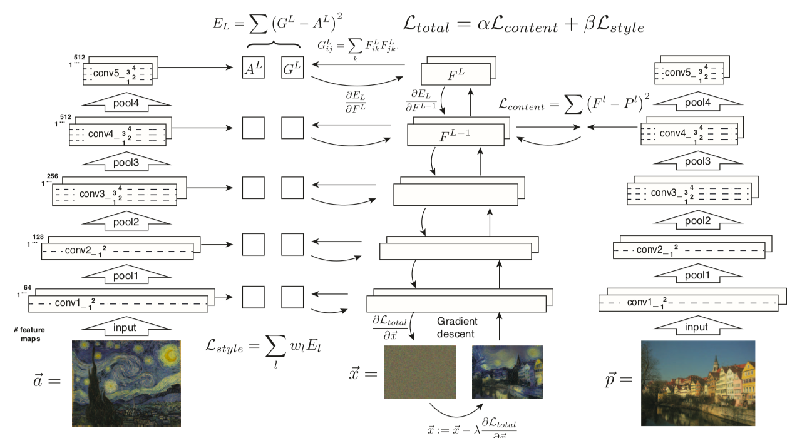

# Description 
In this nural style  transfer  method we are going to take in style of 2 different images and combine it with a qr code to execute  new artistic qr  code 
<br> this diagrams details you how the model exection can take place for a nural style transfer 

<br>
The pipeline of the proposed methodology is as follows:

<br> <p>


 </p>
<br>

To begin with, the results of comparison with existing NST (Neural Style Transfer) techniques or QR code generation methods are as follows.
<p>

</p>
Comparing Ours with the others, the generated results are of lesser quality than the existing NST examples, and do not produce a large amount of point-like noise as compared to existing art-like QR code generation methods.

<br>
About the success probability of reading

For the generated image, the following results are obtained when the image is displayed on the screen in three sizes (3cm x 3cm, 5cm x 5cm, and 7cm x 7cm) and scanned at a distance of 20cm. This table shows the average number of successful scans for 50 scans of 30 QR codes using each mobile device (successful decoding within 3 seconds is considered successful).
In general, the success rate is at least 96%, indicating that the proposed method is robust enough to be effective in real applications. (Even when the scan failed, the read seemed to succeed although it took more than 3 seconds to complete.)


<br>

The results of the comparison with the existing method when changing the distance and angle and η  are shown in the following figure.

<br>


Pytorch implementation of [Image Style Transfer Using Convolutional Neural Networks](https://www.cv-foundation.org/openaccess/content_cvpr_2016/papers/Gatys_Image_Style_Transfer_CVPR_2016_paper.pdf). It is my first paper implementation so it would be quite awkward. I recommend you use it only for a reference. The [Tutorial Code](https://pytorch.org/tutorials/advanced/neural_style_tutorial.html) was very helpful for me to complete my code.


<table>
  
<tr>
   <td align="center">Style&Content</td>
   <td align="center">Output</td> 
</tr>
 


 <tr>
 <td height="250" width="280" align="center"><div align=center></td>
 <td rowspan="2" align="center" width="550" height="550"></td>
</tr>
<tr height="250">
  <td align="center" width="280"><div align=center><div align=center></td> 
</tr>  
 

<tr>
 <td height="250" width="280" align="center"><div align=center></td>
 <td rowspan="2" align="center" width="550" height="550"></td>
</tr>
<tr height="250">
  <td align="center" width="280"><div align=center><div align=center></td> 
</tr>
    

<tr>
 <td height="250" width="280" align="center"><div align=center></td>
 <td rowspan="2" align="center" width="550" height="550"></td>
</tr>
<tr height="250">
  <td align="center" width="280"><div align=center><div align=center></td> 
</tr>


<tr>
 <td height="250" width="280" align="center"><div align=center></td>
 <td rowspan="2" align="center" width="550" height="550"></td>
</tr>
<tr height="250">
  <td align="center" width="280"><div align=center><div align=center></td> 
</tr>
    
<tr>
 <td height="250" width="280" align="center"><div align=center></td>
 <td rowspan="2" align="center" width="550" height="550"></td>
</tr>
<tr height="250">
  <td align="center" width="280"><div align=center><div align=center></td> 
</tr>

</table>


# Get started 
## Prerequisites
 
 * Linux or Windows
 * CPU or NVIDIA GPU + CUDA 
 * Python 3
 * Pytorch 

## Getting Started

### Installation

* Clone this repo:
```
    git clone - the branch : 
    cd ArtCoder
```
* Install PyTorch and other dependencies.
```
pip3 install torch torchvision 
pip3 install matplotlib
pip3 install numpy
pip3 install pandas
```

### Quick Start
* Get detailed information about all parameters using
```
    python main.py -h
```

* Generate your customized Stylized QR codes:
```
    python main.py -style_img_path ./xxxx/xxx.jpg  --content_img_path ./xxxx/xxx.jpg --code_img_path ./xxxx/xxx.jpg --output_dir ./xxxx/
```

* or else you can directly edit the file main.py and putting in the requried arguments 

edit the image locaction, set epoch , style_weight and model_size
```
 parser.add_argument('--style_img_path', help="path to input style target (default: './style/texture1.1.jpg')", type=str,
                        default='./style/texture1.1.jpg')
    parser.add_argument('--content_img_path', help="path to input content target (default: './content/boy.jpg')", type=str,
                        default='./content/boy.jpg')  
    parser.add_argument('--code_img_path', help="path to input code target (default: './code/boy.jpg')", type=str,
                        default='./code/boy.jpg')
    parser.add_argument('--output_dir', help='path to save output stylized QR code', type=str,
                        default='./output/')

```
 for instance here the locations are 
 ```
  --style_img_path =  ./style/texture1.1.jpg 
  --content_img_path =  ./content/boy.jpg
  --code_img_path =  ./code/boy.jpg     
  --output_dir =        ./output/
```


### Notices
* The input code images (--code_img_path) are generated by the algorithm on the website https://meiyaoma.com/ . Of course, it is OK to use traditional QR codes (square modules appear as random distribution) as the input code images, and it just compromises some visual quality. 
<table>
<tr height="200">
    <td    align="center"><div align=center></td>
         <td    align="center"><div align=center></td>
</tr>
</table>

* The QR codes of version 5 is used by default ```(37*37 modules)```. If you want to use different versions of QR code, you need to adjust the parameters ```--module_number (default: 37)```.


### References and credits 
* for the usage assets and models , follow <a href="https://arxiv.org/pdf/2011.07815v1.pdf">documentation</a>

### Owner / author 
~~~Devesh 
